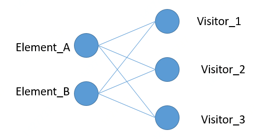

# 设计模式的六大原则

设计模式的世界丰富多彩，比如生产一个个“产品”的工厂模式，衔接两个不相关接口的适配器模式，用不同的方式做同一件事的策略模式，构建步骤稳定、根据构建过程的不同配置构建出不同对象的建造者模式等等。

无论何种设计模式，都是基于六大设计原则：

- 开闭原则：一个软件实体如类、模块和函数应该对**修改封闭，对扩展开放。**
- 单一职责原则：一个类只做一件事，一个类应该只有一个引起它修改的原因。
- 里氏替换原则：子类应该可以完全替换父类。也就是说在使用继承时，只扩展新功能，而不要破坏父类原有的功能。
- 依赖倒置原则：**细节应该依赖于抽象，抽象不应依赖于细节。**把抽象层放在程序设计的高层，并保持稳定，程序的细节变化由低层的实现层来完成。
- 迪米特法则：又名“最少知道原则”，一个类不应知道自己操作的类的细节，换言之，只和朋友谈话，不和朋友的朋友谈话。
- 接口隔离原则：客户端不应依赖它不需要的接口。如果一个接口在实现时，部分方法由于冗余被客户端空实现，则应该将接口拆分，让实现类只需依赖自己需要的接口方法。

# 创建型模式

创建型模式包括：

简单工厂模式，工厂方法模式，抽象工厂模式，单例模式，建造者模式，原型模式。

场景/需求：隐藏实际对象类型，隐藏实例对象的创建逻辑，把对象的创建和使用隔离（创建过于复杂？），个性化定制对象创建过程。

# 工厂模式

### 简单工厂模式

不需要知道怎么创建对象，只需要知道需要什么对象，即可。

实现：

```python
import abc
class Fruit(metaclass=abc.ABCMeta):
    @abc.abstractclassmethod
    def eat():
        pass
class Apple(Fruit):
    def eat(self):
        print("吃了一个苹果!")
class Pear(Fruit):
    def eat(self):
        print("吃了一个梨子!")
class FruitFactory:
    def create(self, fruit_type: str) -> Fruit:
        if fruit_type == '苹果':
            return Apple()
        elif fruit_type == '梨子':
            return Pear()
        else:
            raise Exception("暂时没有没有这种水果")
```

使用

```python
fruit_factory = FruitFactory()
apple = fruit_factory.create("苹果")
pear = fruit_factory.create("梨子")
apple.eat()
pear.eat()
```

# 工厂方法模式

为每个对象创建的过程写一个工厂类去创建它。

```python
class AppleFactory:
    @staticmethod
    def create() -> Apple:
        return Apple()
class PearFactory:
    @staticmethod
    def create() -> Pear:
        return Pear()
```

使用

```python
apple = AppleFactory.create()
pear = PearFactory.create()
apple.eat()
pear.eat()
```

# 抽象工厂模式

将具有相同特点的工厂抽象出一个抽象工厂类，这些工厂都继承自它，并具体实现不同的工厂方法

```python
class IFactory(metaclass=abc.ABCMeta):
    @abc.abstractmethod
    def create(self):
        pass
class AppleFactory(IFactory):
    @staticmethod
    def create() -> Apple:
        return Apple()
class PearFactory(IFactory):
    @staticmethod
    def create() -> Pear:
        return Pear()
```

# 单例模式

某个对象全局只需要一个实例时，可以使用单例模式。它的优点：

- 它能够避免对象重复创建，节约空间并提升效率
- 避免由于操作不同实例导致的逻辑错误

他需要：保证某个类只有一个实例，并这个实例能在全局使用。

**基于new方法的单例**

python创建对象时先调用new方法，新建出一个对象，然后用init进行初始化。

```python
import threading
class Singleton(object):
    _instance_lock = threading.Lock()

    def __init__(self,x=0):
        self.x = x
    
    def __new__(cls, *args, **kwargs):
        if not hasattr(Singleton,'_instance'):
            # 使用反射判断
            with Singleton._instance_lock:
                if not hasattr(Singleton,'_instance'):
                    print("111")
                    Singleton._instance = super().__new__(cls)

        return Singleton._instance

a = Singleton(1)
b = Singleton(2)
print(id(a))
print(id(b))
print(a.x)
print(b.x)

输出
# 111
# 139900384491952
# 139900384491952
# 2
# 2  因为是先new再init 所有，init把原来对象的x由1变成了2
```

基于get_instance方法

```python
import threading
class Singleton(object):
    __instance_lock = threading.Lock()
    __instance = None
    def __init__(self,*args,**kwargs):
        pass

    @classmethod
    def get_instance(cls,*args,**kwargs):
        if Singleton.__instance is None:  # 两个判断是因为只有一个锁+一个判断会很慢，因为每次获取实例都加锁就很慢，
            with Singleton.__instance_lock:
                if Singleton.__instance is None:
                    print("111")
                    Singleton.__instance = Singleton(*args,**kwargs)

        return Singleton.__instance

a = Singleton.get_instance()
b = Singleton.get_instance()
print(id(a))
print(id(b))
```

使用模块

```python
mysingleton.py

class Singleton(object):
    def foo(self):
        pass
singleton = Singleton()

使用
from singleton.mysingleton import singleton
```

使用装饰器

```python
def singleton(cls):
    _instance = {}
    def _singleton(*args, **kwargs):
        if cls not in _instance:
            _instance[cls] = cls(*args, **kwargs)
        return _instance[cls]
    return _singleton

@singleton
class A:
    def __init__(self,x=0):
        self.x = x
a = A(1)
b = A(2)
print(id(a))
print(id(b))
```

# 建造者模式

优点：使用建造者模式的好处是不用担心忘了指定某个配置，保证了构建过程是稳定的。在 OkHttp、Retrofit 等著名框架的源码中都使用到了建造者模式。

python中使用默认参数保证，有基本的配置？？？

**定义：将一个复杂对象的构建与它的表示分离，使得同样的构建过程可以创建不同的表示。**

# 原型模式

**定义：用原型实例指定创建对象的种类，并且通过拷贝这些原型创建新的对象**

python中copy为浅拷贝，即被拷贝对象里的引用对象没有真正的拷贝，还是引用，

copy.deepcopy是深拷贝，递归实现，对象里的也是真正的拷贝。

例如[1,2,[2,3,4],3] 浅拷贝的话 里面的列表还是引用，深拷贝的话，里面的列表就不是了，是新建的一个。

# 结构型模式

结构型模式包括：适配器模式，桥接模式，组合模式，装饰模式，外观模式，享元模式，代理模式，

- 适配器模式：将一个类的接口转换成客户希望的另外一个接口。适配器模式使得原本由于接口不兼容而不能一起工作的那些类可以一起工作。
- 桥接模式：将抽象部分与它的实现部分分离，使它们都可以独立地变化
- 组合模式：将对象组合成树形结构以表示“部分-整体”的层次结构，组合模式使得用户对单个对象和组合对象的使用具有一致性。
- 装饰模式：动态地给一个对象添加一些额外的职责。就增加功能来说，装饰模式相比生产子类更加灵活。
- 外观模式：为子系统中的一组接口提供一个一致的界面，外观模式定义了一个高层接口，这个接使得这一子系统更加容易使用。
- 享元模式：运用共享技术有效地支持大量细粒度的对象。对象复用，不用创建很多个对象，节省资源。
- 代理模式：为其它对象提供一种代理以控制对这个对象的访问。

# 解释器模式

**定义：给定一个语言，定义它 的文法的一种表示，并定义一个解释器，这个解释器使用该表示来解释语言中的句子。**

应用：DSL（domain-specific language），正则表示式，浏览器（将符合W3C标准的序列解析成我们看到的网页，比如解析HTML）

怎么使用：用类来表示文法规则，使得文法易于改变和扩展。

何时使用：当有一个语言需要解释执行，并且能表示成**抽象语法树**时，可使用解释器模式

# 访问者模式

**定义：表示一个作用于某对象结构中的各元素的操作。它使你可以在不改变各元素的类的前提下定义作用于这些元素的新操作。**

元素和访问者结构：



结构实现： 2元素，3访问

```python
#  结构实现
import abc

class Element(metaclass=abc.ABCMeta):
    @abc.abstractclassmethod
    def accept(self, vistor):
        # visitor Visitor类型
        pass

    
class ConcreteElementA(Element):
    def accept(self, visitor):
        # A 被不同的visitor访问
        visitor.visit_concrete_elementA(self)
    
    def __repr__(self):
        return "Element A"
    
    
class ConcreteElementB(Element):
    def accept(self, visitor):
        visitor.visit_concrete_elementB(self)
    
    def __repr__(self):
        return "Element B"
    
    
class Visitor(metaclass=abc.ABCMeta):
    @abc.abstractclassmethod
    def visit_concrete_elementA(self, elementA: ConcreteElementA):
        pass
    def visit_concrete_elementB(self, elementB: ConcreteElementB):
        pass

    
class ConcreteVisitor1(Visitor):
    def visit_concrete_elementA(self, elementA: ConcreteElementA):
        print("{} --> {}".format(elementA, self))
        
    def visit_concrete_elementB(self, elementB: ConcreteElementB):
        print("{} --> {}".format(elementB, self))
    
    def __repr__(self):
        return "visitor 1"

    
class ConcreteVisitor2(Visitor):
    def visit_concrete_elementA(self, elementA: ConcreteElementA):
        print("{} --> {}".format(elementA, self))
        
    def visit_concrete_elementB(self, elementB: ConcreteElementB):
        print("{} --> {}".format(elementB, self))
    
    def __repr__(self):
        return "visitor 2"

    
class ConcreteVisitor3(Visitor):
    def visit_concrete_elementA(self, elementA: ConcreteElementA):
        print("{} --> {}".format(elementA, self))
        
    def visit_concrete_elementB(self, elementB: ConcreteElementB):
        print("{} --> {}".format(elementB, self))
    
    def __repr__(self):
        return "visitor 3"
```

调用

```python
element_a = ConcreteElementA()
element_b = ConcreteElementB()
visitor_1 = ConcreteVisitor1()
visitor_2 = ConcreteVisitor2()
visitor_3 = ConcreteVisitor3()
element_a.accept(visitor_1)
element_a.accept(visitor_2)
element_a.accept(visitor_3)
element_b.accept(visitor_1)
element_b.accept(visitor_2)
element_b.accept(visitor_3)
```

扩展新的visitor（对原来的类没有修改，修改封闭，但是能扩展新visitor，扩展开放）：

```python
class ConcreteVisitor4(Visitor):
    def visit_concrete_elementA(self, elementA: ConcreteElementA):
        print("{} --> {}".format(elementA, self))
        
    def visit_concrete_elementB(self, elementB: ConcreteElementB):
        print("{} --> {}".format(elementB, self))
    
    def __repr__(self):
        return "visitor 4"
visitor_4 = ConcreteVisitor4()
element_a.accept(visitor_4)
element_b.accept(visitor_4)
```

优点：增加visitor（新操作，新算法）容易，只需新写一个visitor类即可，

缺点：增加新元素（新对象结构）困难，需要对之前所有visitor类都改动（违背开闭原则）

适用场景：数据结构相对稳定的系统，即element 不会变的系统。

双分派：element的accept函数调用的时候分派了两次，第一次，将不同的visitor传进element的accept函数，第二次，element将self（C++或者java里是this）传给visitor的visitor_concrete_elementA/B这一函数。使得得到的操作取决于两个因素：element和visitor类型。