# 多源数据融合
## 综述
- Zheng, Y. (2015). Methodologies for Cross-Domain Data Fusion: An Overview. IEEE Transactions on Big Data, 1(1), 16–34. https://doi.org/10.1109/tbdata.2015.2465959

### 多源数据定义

来自不同领域的数据集，例如我们要改善城市规划，可能要用到的数据集有：路网数据，交通流量数据，POI数据，人口数据。
这些数据就是来自不同领域的数据，需要更好地融合这些数据集中的知识。

### 方法分类
1. **STAGE-BASED** 

在数据挖掘任务的不同阶段，采用不同的数据集。

**例子1（路网数据和出租车轨迹数据）：**

stage1：通过主干路网将城市划成不同区域

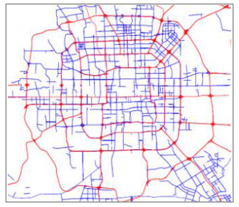

stage2：通过出租车轨迹数据，画出一个graph，点代表stage1中构造的区域，
边代表出租车的移动。

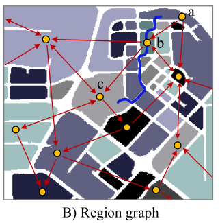

最终通过这个graph可以用来分析很多东西（比如哪两个区域的路规划的不好）

**例子2（用户轨迹和POI数据）**

stage1：通过轨迹数据获取用户的驻留点

stage2：通过驻留点的POI数据，将驻留点描述成一个向量，将向量进行层次聚类，
得到一个树状的结构

stage3：由于不同用户的轨迹最终变成了驻留点向量，在不同的树形结构的不同layer
有不同的图结构。可以通过这个比较用户间的相似度

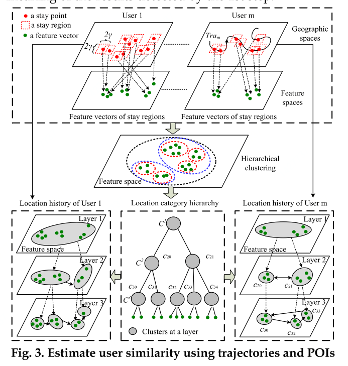

**例子3（车辆轨迹数据和路网数据）**

用车辆轨迹数据和路网数据检测城市交通异常，例子1的一个具体例子。

交通异常的定义：当一些事情（如火灾，游行，阅兵）发生时，周围的交通状况会表现出与平时不一样的行为模式

2. **FEATURE-LEVEL-BASED**

2.1 直接连接

即将两个从数据集中提取出的特征向量直接拼接在一起。

缺点：容易过拟合，忽略了特征之间的非线性关系和相关性。

2.2 基于DNN的特征融合

要融合视频和音频数据的特征，文本和图像的特征，可以采用AutoEndcoder的方式

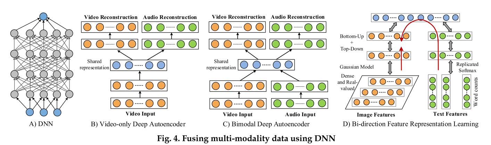

- 蓝色表示最终融合出来的特征

A：用视频重建音频和视频

B：用视频和音频一起重建视频和音频

C：双向的，一个是用文本重建图像，一个是用图像重建文本

3. **SEMANTIC MEANING-BASED**

3.1 **基于多视图（Multi-View Based）**

**多视图的定义**

一个对象的不同描述形式，例如描述一个人可以用人脸，手印，签名。
描述一张图像，可以用很多像素，也可以用文字。

结合一个对象的多视图可以更好地描述一个对象。

**多视图方法的分类**

1. 基于协同训练的（co-training）

一个典型的协同训练过程：

有标签数据集L，无标签数据集U，先采样出一个无标签的子集U'，然后用L训练基于两个
view的分类器f1，f2，用f1和f2去给U'打标签，各自选出概率最高p个正样本和n个负样本，
把这2p+2n和样本和标签送入L，然后把U'重新填满到原先的大小（即再从U中采样2p+2n个无标签样本）。

一个协同训练预测细粒度空气质量的例子

（用粗粒度空气质量，气象数据，交通流量数据，POI数据，路网这五个数据集）

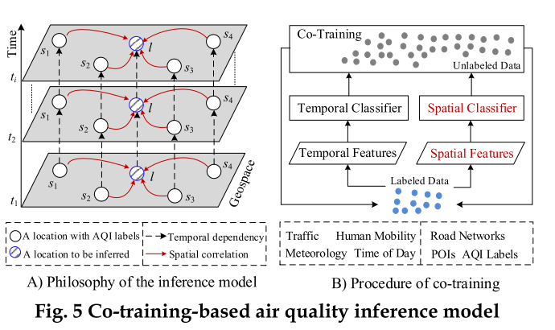

蓝色斜线的点为新增加的细粒度空气质量（通过model推断出来的）。

先是通过空间特征推断，然后用空间和时间特征一起推断后面的点。

label data：粗粒度空气质量

unlabel data：细粒度的空气质量

2. 基于多核学习的（Multi-Kernel Learning）

**MKL定义**

A kernel is a hypothesis on the data, which could be a similarity notion, or a classifier, or a regressor.

A learning method picks the best kernel, or uses a combination of these kernels.

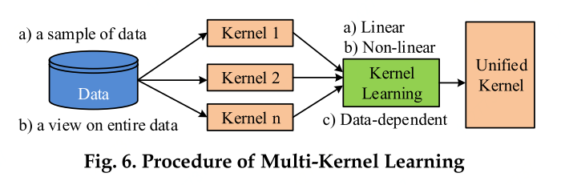

**现有MKL分类**

1.weight和base learners一起训练，

2.在一轮迭代中，固定一个，训练另一个，然后反之。

随机森林等集成学习方法就是一种MKL。

**一个空气质量预测的例子**

时间kernel和空间kernel，Prediction Aggregator是一个kernel learning method。

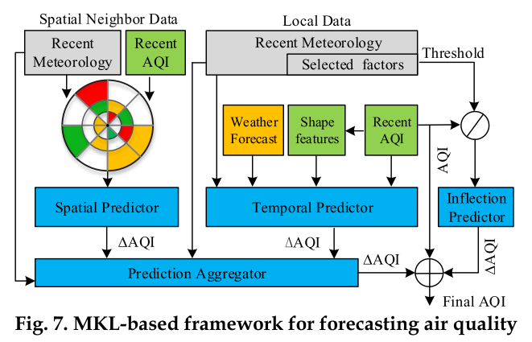

3. 基于子空间的（subspace learning）

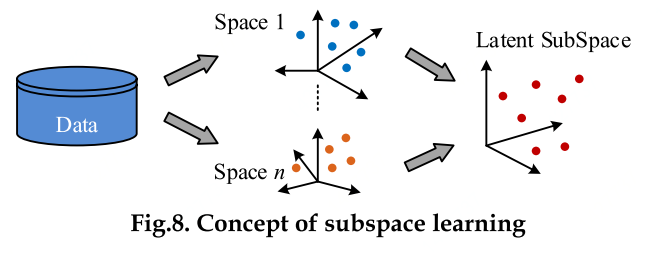

PCA（主成分分析）和CCA（典型相关性分析）

3.2 **基于相似性（Similarity-Based）**

1. 耦合矩阵分解（Coupled Matrix Factorization）

**例子10（位置和活动的推荐）**

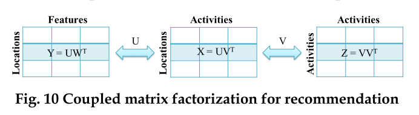

X是一个稀疏矩阵，$X_{ij}$ 表示位置i出现活动j的频率，通过矩阵分解的方式进行缺失值填补。
填补后可以进行推荐（对活动推荐topK位置，对位置推荐活动）。

Y是一个位置的地理特征，比如POI信息

Z是一个活动之间的相关性矩阵。

最终的目标函数如下所示，前半部分即分解矩阵要尽可能和原矩阵接近，后半部分为正则项。

$$L(U, V, W)=\frac{1}{2}
$$

**例子11（估计路段的车速值）**

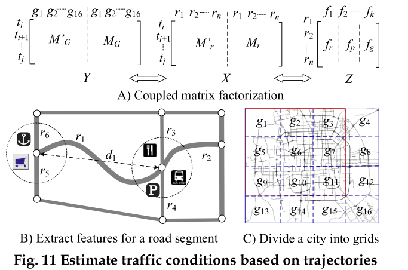

$M^{'}_r$代表时间t，路段r的车速实际值，$M_r$代表车速的平均值（基于历史数据），通过taxi轨迹数据建立，稀疏

Z代表路段的特征，例如路段的POI，路段的限速，车道数等特征。

$M_G$代表时间t，网格g的车流量，有平均值和实际值。

目标函数为

$$L(T, R, G, F)=\frac{1}{2}\left\|Y-T(G ; G)^{T}\right\|^{2}+\frac{\lambda_{1}}{2}\left\|X-T(R ; R)^{T}\right\|^{2} \\
+\frac{\lambda_{2}}{2}\left\|Z-R F^{T}\right\|^{2}+\frac{\lambda_{3}}{2}\left(\|T\|^{2}+\|R\|^{2}+\|G\|^{2}+\|F\|^{2}\right)
$$

2. 流形对齐（Manifold Alignment）

**例子12（细粒度城市噪声）**

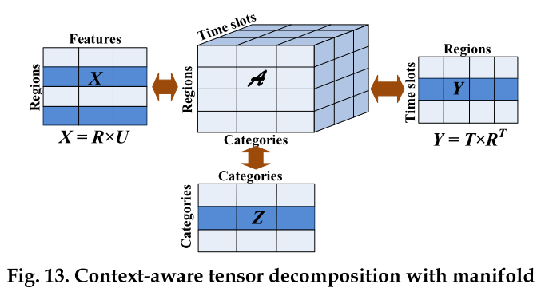

X为区域特征，Z为噪声种类相关性，Y为时间t区域r的人流量。

目标函数为

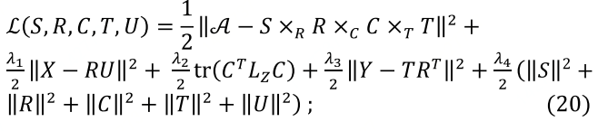

前面是矩阵分解重建误差，后面是正则项

3.3 **基于概率依存关系（Probabilistic Dependency-Based）**

3.4 **基于迁移学习（Transfer Learning-Based）**
