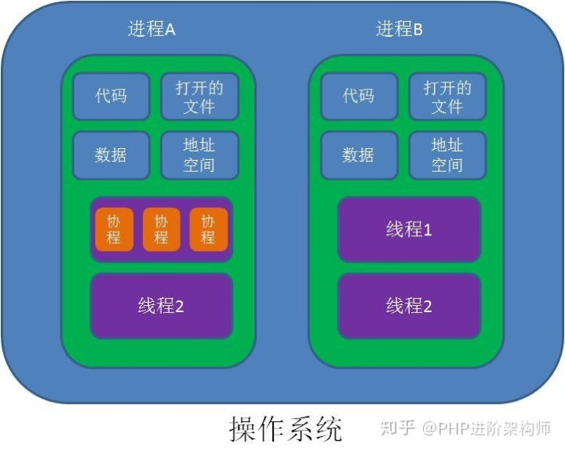

# 说些啥

问下部门的业务，工作情况，技术栈？框架啥的？

看文档看书的重要性？

网上的一些文章有好有差，但是书和文档一般都挺靠谱的，都是书和文档都是由review的，网上大多数文章没有，而且比较容易有写错的地方。

记笔记的重要性？东西多了容易忘，记起来是为了快速回忆找到这个东西，不用费劲去搜索和回忆。

## 实习经历

- 数科-数字网关

参与开发了一个具有隐私保护功能的分布式机器学习框架-数字网关。其主要工作为将分布式计算接入框架中，以及联邦算法模型的开发。

# 操作系统

### 进程/线程/协程

